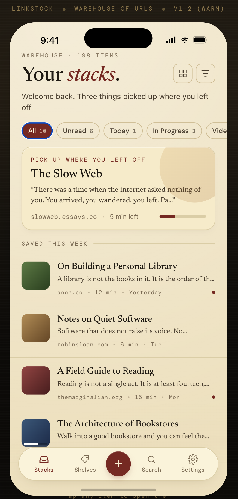
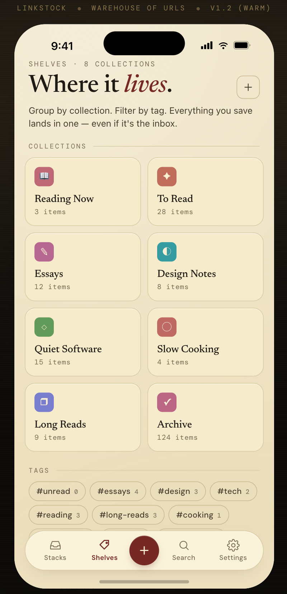
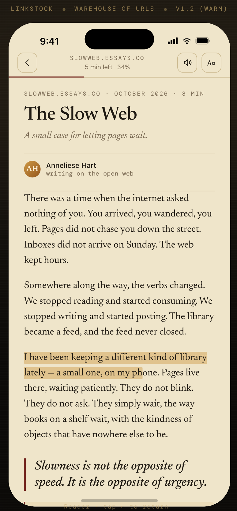
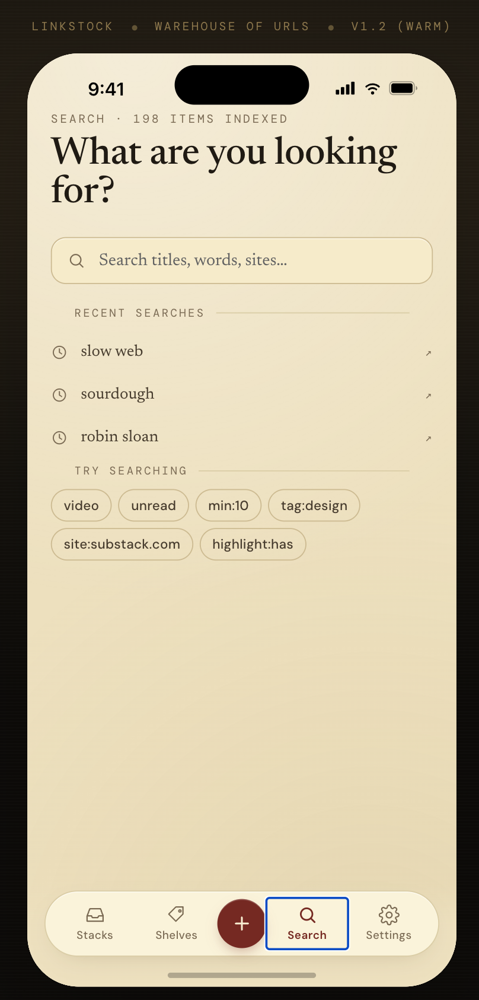
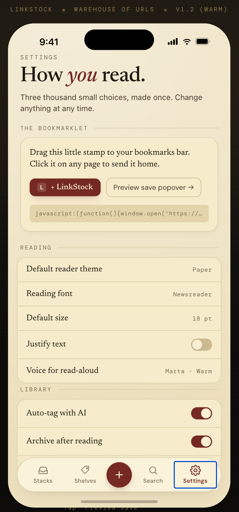

# LinkStock — Warehouse of URLs

A warm, library-feeling iOS read-later app. Save URLs from Safari via the Share Extension, read them in a focused reader with parchment tones and serif fonts.

## Screenshots

<p align="center">
  
  
  
  
  
</p>

## What it is

LinkStock is your personal reading room — not a feed. Articles wait patiently on the shelf until you're ready. Organised by collections and tags, readable offline, beautiful to look at.

## Screens

| Screen | What it does |
|---|---|
| **Stacks** | Your saved items — filter by unread / in-progress / video / today, toggle list or card view |
| **Reader** | Serif reading view with Paper / Sepia / Night themes, font controls, highlights, notes, TTS |
| **Shelves** | Collections grid, tag cloud, smart shelves |
| **Search** | Full-text search across titles, excerpts, authors, and sites |
| **Settings** | Share Extension setup, reading preferences, library options |

## Stack

- **Expo + React Native** — iOS-first
- **Expo Router** — file-based routing with tab + stack navigation
- **MMKV** — fast synchronous local storage, no backend in v1
- **expo-font** — Newsreader, Lora, Crimson Pro, EB Garamond, DM Sans, DM Mono
- **react-native-svg** — thin-stroke icon set

## Saving URLs

LinkStock uses an **iOS Share Extension** — tap the share button in Safari, pick LinkStock, add tags and a note, and the link is filed away instantly.

## Design

Designed in [Claude Design](https://claude.ai/design). Warm paper aesthetic: cream parchment background (`#f1e6cb`), deep ink-brown text, oxblood library-red accent (`#8b3a2e`).

## Getting started

```bash
npx expo start
```

> Requires Xcode for the Share Extension target (Slice 8b).

## Roadmap

See the [open issues](https://github.com/fabiandariusz/linkstock/issues) for the full implementation plan broken into vertical slices.

---

*Made slowly, on a small island, in 2026.*
